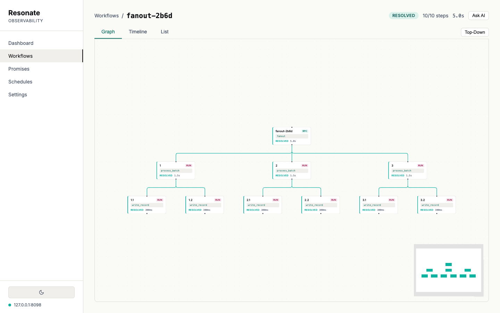
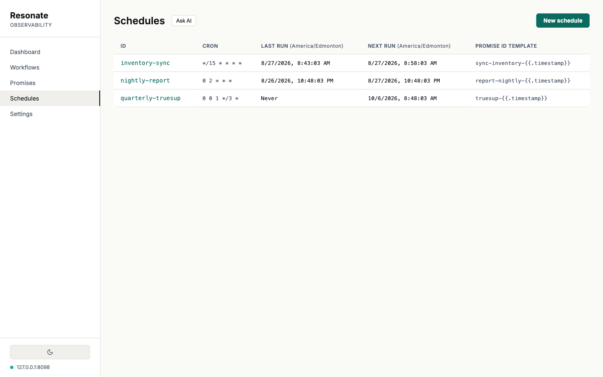
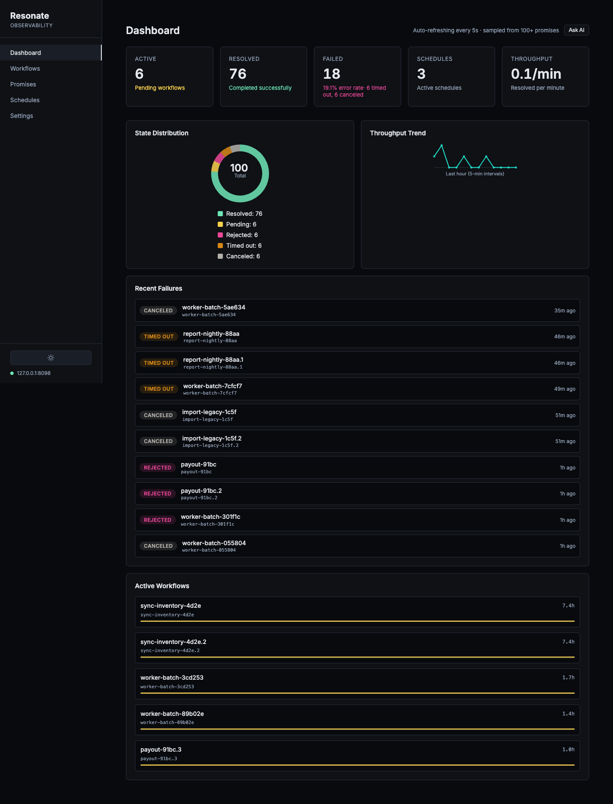

# Resonate Observability

**A console for durable execution.** Every promise on your [Resonate](https://github.com/resonatehq/resonate) server, drawn as the call graph it came from: what ran, what came back, what failed, and where the time went.


Resonate records each step of a durable execution as a promise. This console reads those promises back and reassembles them, so a workflow that fell over at 3am arrives as a picture with a reason attached rather than a query you have to know how to write.

> **Early stage.** Under active development, with real gaps listed under [Known limitations](#known-limitations). [File an issue](https://github.com/resonatehq/resonate-observability-web-ui/issues) or [contribute a fix](CONTRIBUTING.md).

---

## Quick start

Two terminals, and you do not need a server to see it working:

```bash
npm install
npm run mock          # a fixture speaking the real protocol, on :8099
```

```bash
npm run dev           # the console, on :5173
```

Open <http://localhost:5173>.

Every screenshot on this page is that fixture. It seeds six named workflows and a batch queue, anchored to the moment you start it, so the dashboard has a live hour behind it and the schedules have a next run ahead of them. When you want your own data, set the server URL at `/settings`.

---

## What you get

### The whole store on one screen

![The Dashboard. Five tiles across the top read Active 6, Resolved 76, Failed 18 with a 19.1% error rate broken down as 6 timed out and 6 canceled, Schedules 3, and Throughput 0.1 per minute. Below, a donut chart divides 100 promises into five labelled states, and a line chart plots throughput over the last hour in five-minute intervals. A Recent Failures list shows report-nightly-88aa timed out, import-legacy-1c5f canceled and payout-91bc rejected. An Active Workflows list is led by sync-inventory-4d2e, running for 7.1 hours.](docs/screenshots/dashboard-light.png)

Counts by state, the distribution across all five, throughput for the last hour, the failures that just landed, and the workflows that have been running longest. The header names its own sample size, because the server offers no population count and a total invented from one page would be a guess wearing a number's clothes.

### Five states, drawn as five

A rejection, a cancellation and a missed deadline call for three different responses, so they get three different colours and three different labels everywhere they appear. Tooltips say which is which in words.


Graphs lay out automatically, pan and zoom, and hold their shape as the data refreshes underneath. Deeper trees stay readable:



### Where the time actually went


The same run as a waterfall. Bars are positioned and sized by real timings, so a step that sat waiting looks different from a step that worked.

### Why it failed, in the payload


Parameters and return values arrive base64-encoded. The console decodes them and pretty-prints the JSON, so the reason a step failed is on the screen instead of in your clipboard on the way to a decoder.

### Schedules, including new ones




Pick a preset or write cron directly. The form says what the expression means in a sentence and shows the next three fire times before you commit to it. Times are labelled with the zone they are in, on both sides.

### Context for an assistant


Every record-bearing view has an **Ask AI** button that turns what you are looking at into one Markdown document: the schema, the view state, the structure, the raw records and the decoded payloads. It is built in your browser and copied to your clipboard, and it closes with a section listing what it left out — records past the cap, values it could not decode, a view that failed to load.

### Light and dark



Both themes carry the same status palette, and every badge pair clears WCAG AA against its background.

---

## Connecting to your server

Set the URL at `/settings` and press **Test connection**, which reports whether the server answered and whether your token was accepted, as two separate facts.

**CORS.** Your browser calls the server directly, so the server has to allow this page's origin:

```bash
resonate serve --server-cors-allow-origin http://localhost:5173
```

A rejected preflight never reaches the server and arrives back in the browser with no status code at all. **Test connection** tells you when that is what happened.

**Auth.** Relevant when the server runs with `--auth-publickey`. The token is a JWT and travels in the request body as `head.auth`; an `Authorization` header is ignored. It needs an `exp` claim and either `role: "admin"` or an empty `prefix`. A prefix-scoped token is rejected on every search, so it cannot drive this console.

**Behind Cloud Run IAM.** A separate field takes a Google identity token, sent as a header rather than in the body. Mint one with:

```bash
gcloud auth print-identity-token \
  --audiences=<server-url> \
  --impersonate-service-account=<sa>
```

An interactive user account cannot mint an audience-scoped token directly, and the impersonated service account needs `roles/run.invoker`. These expire after an hour and there is no refresh — you paste a fresh one when it lapses.

> The token is held in `localStorage` in plain text, and a token that can drive this console can read and modify every promise on the server. That is a reasonable trade for a tool on your own machine, and the wrong one for a page served on a shared network.

---

## Verified against a real server

The fixture under `mocks/` is not a sketch of the protocol. It is checked against a real `resonate 0.9.8` and the results are compared probe by probe:

| Check | Result |
|---|---|
| `npm test` | **275 tests** |
| `npm run conformance <url>` — protocol probes, mock vs live 0.9.8 | **92 of 92 identical** |
| `npm run cron-differential <url>` — cron expressions, mock vs live 0.9.8 | **563 expressions, 0 mismatches** |

That last one earns its keep. The cron dialect has real traps in it — `1` is Sunday, day-of-month and day-of-week combine in a way that surprises people, and a bounded year turns into a sixty-second timer — and the differential is how the console's validator was brought into line with what the server actually accepts.

Both differentials create and then delete everything they create.

---

## API compatibility

The console speaks the envelope protocol, version **`2026-04-01`**. Every request is a `POST /`:

```jsonc
POST /
{ "kind": "promise.search",
  "head": { "corrId": "…", "version": "2026-04-01", "auth": "<jwt>" },
  "data": { "state": "pending", "limit": 100 } }
```

The server validates the protocol version before dispatch, so a mismatch is reported in plain words. The legacy REST endpoints (`GET /promises`, `/schedules`, …) answer `410 Gone` and are not used.

### What the server does not offer

Worth knowing before filing a bug, because these shape the UI:

- **No ID filter and no sort on search.** `promise.search` takes `{state, tags, limit, cursor}`. Listings come back ordered by promise ID. There are no search boxes, because the server *silently ignores* a parameter it does not recognise, so a search box here would have returned everything while looking like it filtered.
- **The state filter is exact.** Asking for `rejected` excludes `rejected_canceled` and `rejected_timedout`, which is why the filters list all five states separately.
- **No way to list a schedule's runs.** That needs a prefix match on the promise-ID template. The schedule's own `lastRunAt` stands in.
- **No promise-population metrics.** `/metrics` exposes API traffic rather than promise counts by state, so the dashboard counts client-side over one page and says "sampled from N".
- **No task-to-workflow link.** `TaskRecord` carries no promise or root ID, so "which worker is running my stuck workflow" is not answerable yet.
- **Polling, not push.** The server's SSE endpoint serves workers rather than general subscription, so views refresh on a 5s interval and pause when the tab is hidden.

---

## Architecture

```
mocks/                               # Protocol fixture, conformance + cron differentials
src/
├── lib/
│   ├── api/client.ts                # Envelope client, error taxonomy, payload decoding
│   ├── api/bundle.js                # The Ask AI context document
│   ├── components/
│   │   ├── dashboard/               # Metrics, donut, throughput
│   │   ├── graph/                   # Workflow DAG (Svelte Flow + dagre)
│   │   └── timeline/                # Waterfall
│   ├── stores/                      # connection, dashboard, theme
│   └── utils/state.ts               # The one place state becomes colour and label
└── routes/                          # dashboard · workflows · promises · schedules · settings
```

**Static SPA, no proxy.** The build is plain files and nothing server-side runs; the browser talks to your server directly. This replaced a proxy route that fetched a client-supplied URL and mirrored the auth token into a non-`HttpOnly` cookie.

**Single-tenant and self-hosted.** You own the server and the data, so your payloads render as they are. This is a console for your own store.

**One source of truth for status.** `src/lib/utils/state.ts` is the only place a promise state becomes a colour or a label, which is what keeps five states looking like five in every view.

---

## Known limitations

- **Read-only.** There is no cancel or settle. Views poll every 5s, so a write would visibly revert on the next refresh until the mutation layer lands.
- Filter state is component-local, so `/workflows?state=pending` does not restore the filter.
- Graph performance degrades past roughly 1000 nodes in a single tree; there is no virtualization.
- Accessibility gaps: clickable table rows have no keyboard path, and tab bars lack `role="tablist"`.

### Roadmap

- [ ] Shared selection across graph, timeline and list on the run detail view
- [ ] URL-backed filter and view state
- [ ] Operator actions (cancel, settle) with poll suppression and confirmation
- [ ] Accessibility pass: keyboard navigation, ARIA, focus management
- [ ] Many servers, one console — local, staging and production without retyping
- [ ] Scheduled CI job that boots a pinned server and asserts a real round trip

---

## Contributing

See [CONTRIBUTING.md](CONTRIBUTING.md). The fixture makes most changes testable without a server: `npm run mock`, `npm test`, and `npm run conformance <url>` against a real one when you touch the protocol.

Note that this repo has no prettier config and no format script. House style is tabs, single quotes and roughly 110 columns, maintained by hand — running `npx prettier --write` picks up its own defaults and reformats every file it touches.

## License

[Apache 2.0](LICENSE) — same as the Resonate project.

## Links

- [Resonate Server](https://github.com/resonatehq/resonate)
- [Documentation](https://docs.resonatehq.io)
- [Discord](https://discord.gg/AHGHZPrDH3)
- [Resonate HQ](https://www.resonatehq.io)
